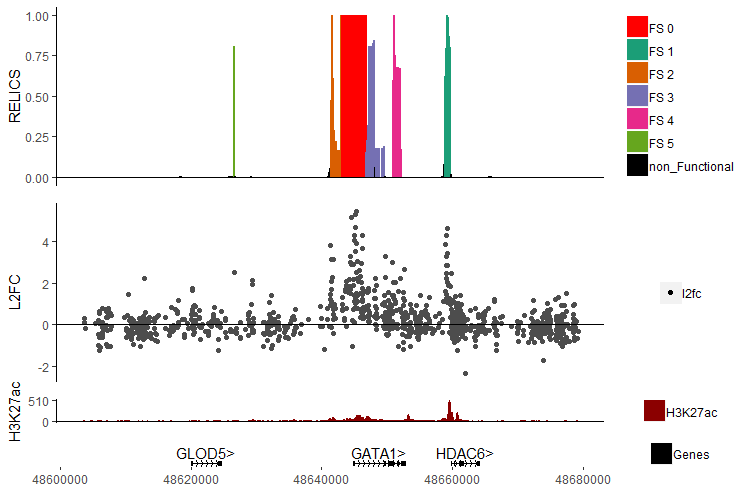

# GenomeColoR
A package for coloring genome tracks by segment types

The main feature of GenomeColoR is to highlighting different regions of the same track with different colors as specified by a set of labels, doing so for multiple tracks while also displaying genes and genome coordinates.



# Installation
GenomeColoR requires R version 3.51 or higher

# Obtain source code
Clone source code to your desired location with the following command: `git clone https://github.com/patfiaux/GenomeColoR.git`. Alternatively, download the repository.

# Install requirements
ou will need the following packages to run RELICS. If you don't have them, install them using the following commands. Installations will take about 5 minutes on a standard laptop.

ggplot2 (for generating the individual tracks)

```install.packages('ggplot2')```

grid (for combining the different tracks)

```install.packages('grid')```

gridExtra (for combining the different tracks)

```install.packages('gridExtra')```


# Bioconductor packages
```r
if (!requireNamespace("BiocManager", quietly = TRUE))

    install.packages("BiocManager")
``` 

GenomicRanges (for handling genomic coordinates)
```r
BiocManager::install("biomaRt")
```

biomaRt (for plotting Genes)
```r
BiocManager::install("GenomicRanges", version = "3.8")
```

# Input data format
GenomeColoR requires data with chromosome positions as well as scores and labels. 
The required columns must have the following information: chromosome, score start, score end, label, score

The columns specifying the above are mandatory and must be labelled `chrom`, `start`, `end`, `label` and `genomeScore` respectively.

Below is part of the example file in the `Data` folder. It's the results of analyzing data from a CRISPR inhibition (CRISPRi) screen by [Fulco et al. (2016)](https://science.sciencemag.org/content/354/6313/769.abstract) with [RELICS](https://github.com/patfiaux/RELICS), a tool developped specifically for analyzing tiling CRISPR screens for the detection of functional sequences (FS).

| chrom | start | end | label | genomeScore | 
|----------|----------|----------|----------|----------|
| chrX | 48603496 | 48603916 | non_Functional | 1.01e-06 |
| chrX | 48603917 | 48605144 | non_Functional | 3.52e-06 |
| chrX | 48658794 | 48658919 | FS 1 | 0.623 |
| chrX | 48658920 | 48659024 | FS 1 | 0.795 |

# Quickstart with example data
In this example we will recreate the figure above:

RELICS reports all functional sequences detected and their location. To keep apart the different FS we will give each of them a distinct color.

We will add in the log2 fold change of the raw data as a separate track as well as an epigentic track that is commonly used as a heuristic for detecting functional sequences.

We recommend that you navigate to the GenomeColoR directory. In an interactive R session

```r
setwd('path/to/GenomeColoR')
```

## 1. Source the script
This will load in all the libraries and necessary functions

```r
source('path/to/Code/GenomeColoR.R')

# if you are already in the GenomeColoR directory:
# source('Code/GenomeColoR.R')
```

## 2. Load in the data
We load in the RELICS scores as well as the raw data given as log2 fold change.
```r
gata1.scores <- read.csv('Data/GATA1_FS_track.csv', stringsAsFactors = F)
gata1.l2fc <- read.csv('Data/GATA1_l2fc_track.csv', stringsAsFactors = F)
```

Finally, we also load in H3K27ac data, an epigentic marker for open chromatin.
```r
gata1.h3k27ac <- read.table('Data/GATA1_H3K27ac_track.txt', header = T, sep = '\t', stringsAsFactors = F)
```

## 3. Set up the input
The main function `plot_tracks` requires at least 3 inputs. 

### 3.1 Track colors 
Specify the colors for each of the tracks from 3.1. Keep in mind that the colors are assigned to the track in the order they are given, not by the name in the list. The latter just helps keeping track of what tracks already have been colored.

The colors for each track are given as `data.frame` where each row corresponds to a label present in the track to plot. 
```r
relics.colors <- data.frame(label = c("FS 0", "FS 1", "FS 2", "FS 3", "FS 4", "FS 5", "non_Functional"),
                            color = c("#FF0000", "#1B9E77", "#D95F02", "#7570B3", "#E7298A", "#66A61E", "#000000"))
                            
l2fc.colors <- data.frame(label = c("l2fc"),
                          color = c('grey30'), 
                          stringsAsFactors = F)
                          
h3k27.colors <- data.frame(label = c("H3K27ac"), 
                           color = c('darkred'), 
                           stringsAsFactors = F)
                           
track.colors <- list(RELICS = relics.colors,
                     L2FC = l2fc.colors,
                     H3K27ac = h3k27.colors)

```

Note that because the labels are treated as factors, it's important to fix their ordering according to the order of the color data frame, else color will not match its label. This is only necessary if there are multiple colors / labels within a track.

```r
gata1.scores$label <- factor(gata1.scores$label, levels = relics.colors$label)
```

### 3.2 Track score type
For each track, provide the type of track you want to plot.
In this case, both the RELICS scores and the H3K27ac track are plotted as continous tracks coloring the height from 0 to the given score. However, the log2 fold change track is plotted with individual points.

```r
track.types <- c('genomeScore', 'pointCloud', 'genomeScore')
```

### 3.3 Tracks to plot
The tracks to plot are provided as a list. Make sure you place the tracks into the list after dealing with the factor issue mentioned in 3.1.

```r
track.scores <- list(RELICS = gata1.scores,
                    L2FC = gata1.l2fc,
                    H3K27ac = gata1.h3k27ac)
```

# 4 Track height
Differnt tracks might have varying importance in your plot. Incrrease the size of on track relative to another to draw attention to the key elements of your figure.

```r
# the track heights are relative, so the numbers here are selected somewhat arbitrarily.
track.heights <- c(4, 4, 0.5)
```

# 5 Plotting
If nothing is specified, GenomeColoR will use hg37 as reference genome. 

```r
# This can take a few seconds to load
plot_tracks(track.scores,
            track.types,
            track.colors,
            track.height = track.heights)
            
#Note, sometimes R can't access the BioMart database, either because of lack of internet connection or work is done on the database. In that case you can specify the `genome.to.use` flag as 'none' to plot without the genes surrounding your area of interest

plot_tracks(track.scores,
            track.types,
            track.colors,
            track.height = track.heights,
            genome.to.use = 'none')
```

# Advanced flags

## Using different genome builds
By default, GenomeColoR uses hg37 to plot your tracks. However, your data may not be from the hg37 build. Plotting is currently possibe with both hg38 as well as the mouse builds mm9 and mm10.
Adjust the `genome.to.use` flag accordingly.

```r
# example not run with the suggested changes as they don't correspond to the correct build.
# This simply serves as example for how to use the flag
plot_tracks(track.scores,
            track.types,
            track.colors,
            track.height = track.heights,
            genome.to.use = 'hg38')  # other options are: 'mm9', 'mm10'
```

## Specifying custom ranges
Instead of having to manually trim all your data to a specific range you can set it.
This can help when zooming in on specific areas.

```r
# example where we zoom in to the GATA1 region
plot_tracks(track.scores,
            track.types,
            track.colors,
            track.height = track.heights,
            x.min = 48640000,
            x.max = 48655000)            
```

## Adding .bed file tracks
Sometimes it's important to not only plot the continous range of scores acros the region, but to point out specific regions of interest. In these cases, the y-axis is meaningless as the function is merely to draw attention to a region, not quantify something.

Here we will add in a .bed file with the target coordinates of sgRNA validations done on FS5 for this data set.
```r
# loadig in the 
fs5.validation <- read.table('Data/FS5_validation.bed', header = F, col.names = c('chrom', 'start', 'end', 'label'), sep = '\t', stringsAsFactors = F)

# add data to the 'track.scores' list. In this case the track will be appended at the end. If a different positioning is desired, the lists for the scores, colors and height have to be adjusted accordingly.
# Currently the only color of .bed style tracks is black, as such the color can be set to the NULL default
track.scores$Validation <- fs5.validation
track.types <- c(track.types, 'bed')
track.colors$Validation <- NULL

track.heights <- c(4, 4, 0.5, 0.5)

plot_tracks(track.scores,
            track.types,
            track.colors,
            track.height = track.heights) 
            
```

## Display only some gene names
If plotting very large regions the 'Genes' track can get overly crowded with gene names. 
In such a case, the user can specify what gene names are to be displayed. For all other genes the location is still being displayed.

```r
plot_tracks(track.scores,
            track.types,
            track.colors,
            track.height = track.heights,
            only.gene = c('GATA1', 'GLOD5'))
```
